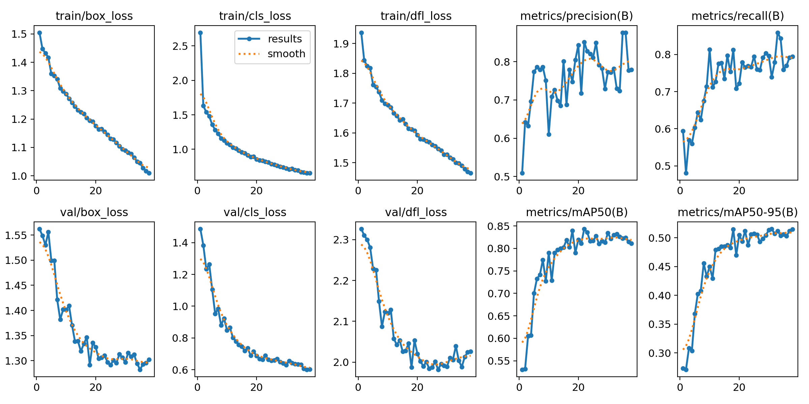
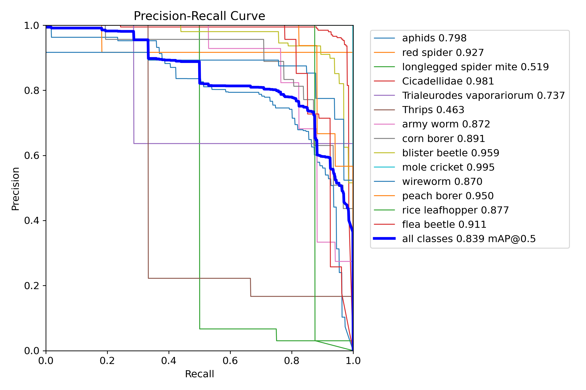
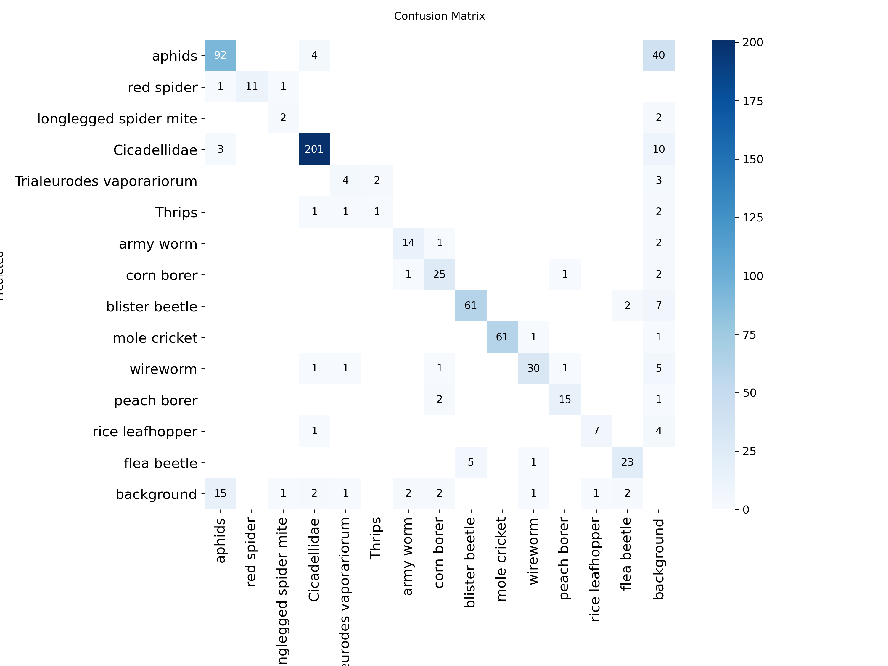
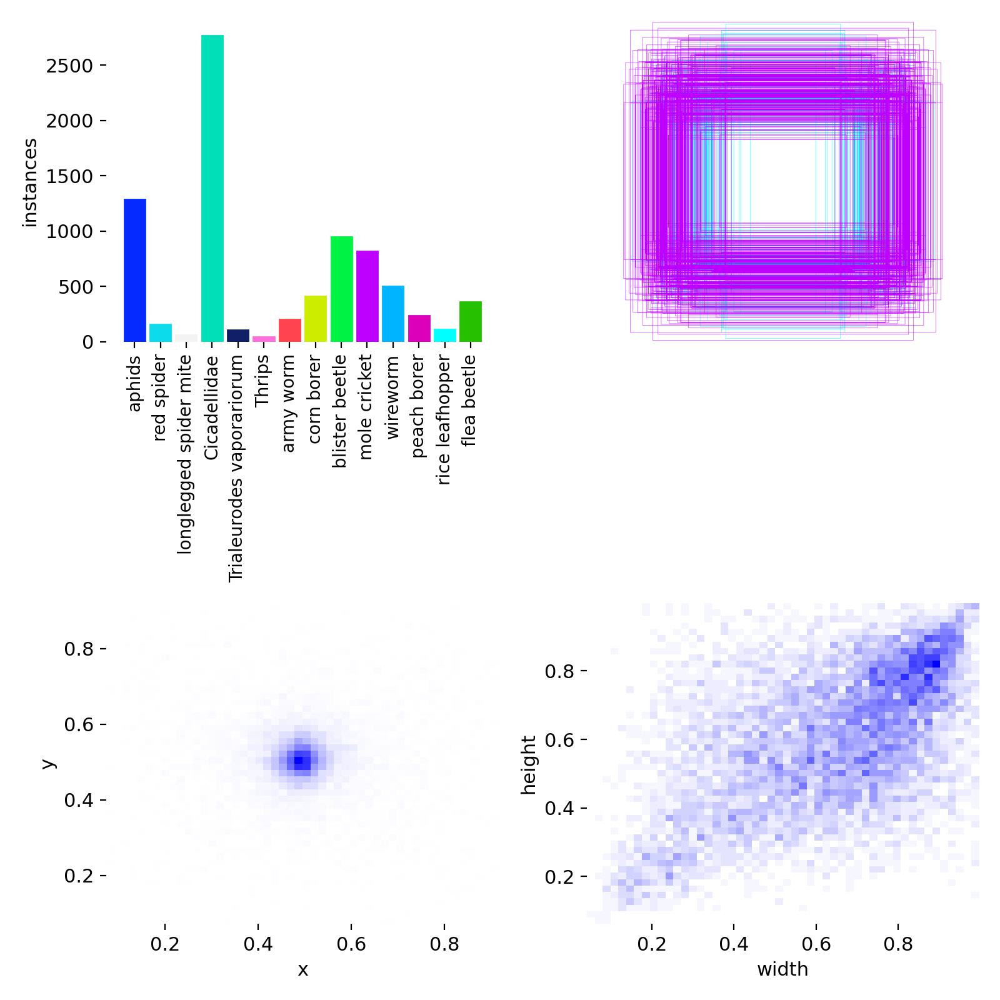
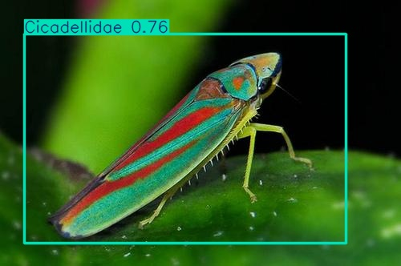
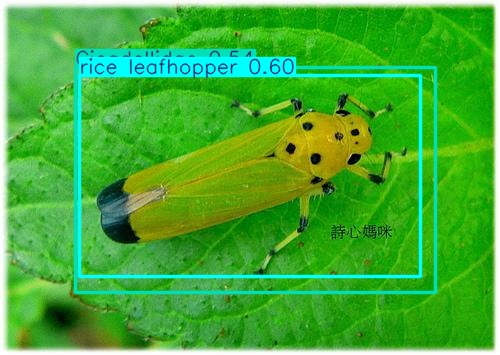
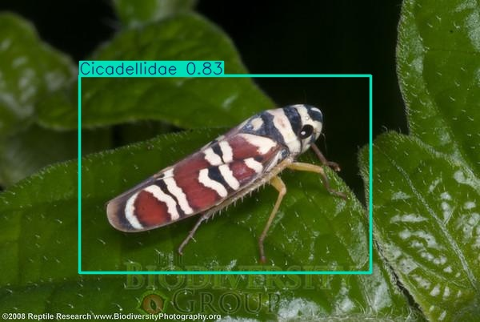

# Pest Detection & Monitoring (YOLOv8 + OpenCV)

Real-time crop **pest detection and monitoring** using **YOLOv8** and **OpenCV**, trained on a curated subset of IP102 (15 classes).
Includes a live “state engine” (Matplotlib) to plot detection counts over time.

https://github.com/<your-username>/pest-detector

---

## 🔧 Tech
- Ultralytics YOLOv8
- PyTorch
- OpenCV
- Matplotlib

---

## 📦 Setup

```bash
# (optional) create env
conda create -n pestdet python=3.10 -y
conda activate pestdet

# install PyTorch (choose CUDA/CPU wheels accordingly)
pip install --extra-index-url https://download.pytorch.org/whl/cu121 torch torchvision torchaudio

# install others
pip install -r requirements.txt
```

## 📚 Data

To build the subset locally:
```bash
python src/make_subset.py \
  --src /path/to/IP102_YOLOv5 \
  --dst data/pest_subset \
  --classes "aphids, red spider, longlegged spider mite, Cicadellidae, Trialeurodes vaporariorum, Thrips, army worm, corn borer, blister beetle, mole cricket, wireworm, peach borer, rice leafhopper, flea beetle"

```
This creates:
```bash
data/pest_subset/
  images/{train,val}/
  labels/{train,val}/
  pest_subset.yaml
```

## 🏋️‍♀️ Train
# small but accurate baseline for tiny pests
```bash
yolo task=detect mode=train \
  model=yolov8s.pt \
  data=data/pest_subset/pest_subset.yaml \
  epochs=50 imgsz=832 batch=8 device=0 workers=8 cache=ram patience=20
```
##✅ Validate & Visualize

```bash
yolo task=detect mode=val \
  model=runs/detect/train/weights/best.pt \
  data=data/pest_subset/pest_subset.yaml imgsz=832 augment=True

# quick prediction on val images
yolo task=detect mode=predict \
  model=runs/detect/train/weights/best.pt \
  source=data/pest_subset/images/val \
  save=True conf=0.30
```

# Key plots (from runs/detect/train*):

- results.png – training curves

- PR_curves.png – precision–recall per class

- confusion_matrix.png – class confusions

- labels.jpg – label distribution

## 📈 Results (example)

- mAP@0.5: ~0.84 on 15 classes

- Strong classes: cicadellidae, red spider (mites), mole cricket, flea beetle

- Challenging: thrips, longlegged spider mite (few annotations)

# 📊 Training Curves


# 🎯 Precision–Recall Curve


# 🔵 Confusion Matrix


# Label distribution



# Sample detections

<p float="left">    </p>


## 📝 License

MIT:

# Initialize the repo & push to GitHub

```bash
# from your local folder 'pest-detector'
git init
git add .
git commit -m "Initial commit: YOLOv8 pest detector + subset + demo assets"

# create a new empty repo on GitHub, e.g. https://github.com/<you>/pest-detector
git branch -M main
git remote add origin git@github.com:<your-username>/pest-detector.git   # or https://...
git push -u origin main
```


